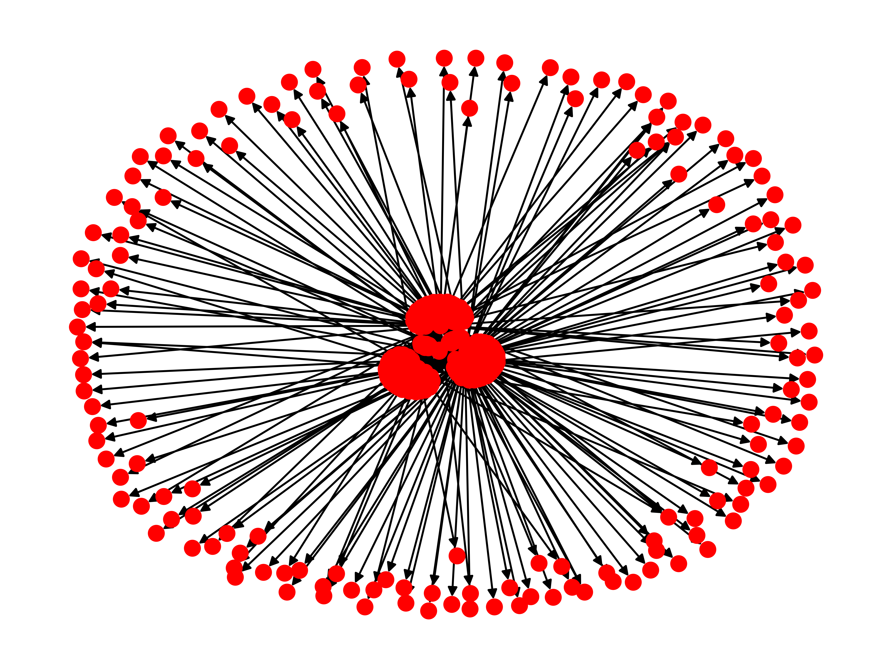

# SNA
> A tool for analyzing social structures within the Twitter network 



## Getting Started

1. Clone the repo

    ```$ git clone https://github.com/tazzaoui/sna.git && cd sna```

2.  Install the necessary dependencies

    ```$ pip install --user -r requirements.txt```

3. Head over to [https://developer.twitter.com/](https://developer.twitter.com/) to obtain API credentials. Fill in `credentials.py` accordingly

4. Extract the information of a few twitter users

     ```
     $ ./extract.py user-1
     $ ./extract.py user-2
    ...
    $ ./extract.py user-n
    ```

5. Visualize the conectivity of the social circle centered around those users

    ```$ ./visualize.py```

## Files

* `user.py`: A wrapper around the Twitter API. Provides access to a user's
  * followers
  * friends
  * mentions
  * favorites
* `extract.py`: Given a valid usename as a command line argument, this script uses the `User` class to fetch the user's information locally.

```
usage: extract.py [-h] [--followers] [--friends] [--mentions] [--favorites]
                  username

positional arguments:
  username     A valid Twitter user name

optional arguments:
  -h, --help   show this help message and exit
  --followers  Fetch the user's followers
  --friends    Fetch the user's friends
  --mentions   Fetch a list of mentioned users
  --favorites  Fetch a list of the users whose tweets were favorited
```

* `graph.py`: Uses the individual data generated by `extract.py` to construct a social network and provides an interface for visualizing this network

## Dependencies
* tweepy
* networkx
* matplotlib

## Note: Beware of Rate Limiting
Twitter limits the number of requests one can make in a 15 minute interval. Beware of this when extracting user information. See here for more on Twitter's policies: [https://developer.twitter.com/en/docs/basics/rate-limiting.html](https://developer.twitter.com/en/docs/basics/rate-limiting.html)
